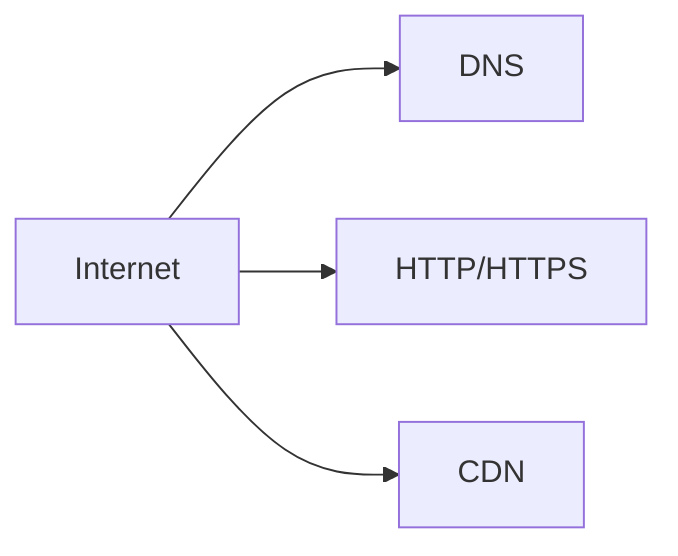
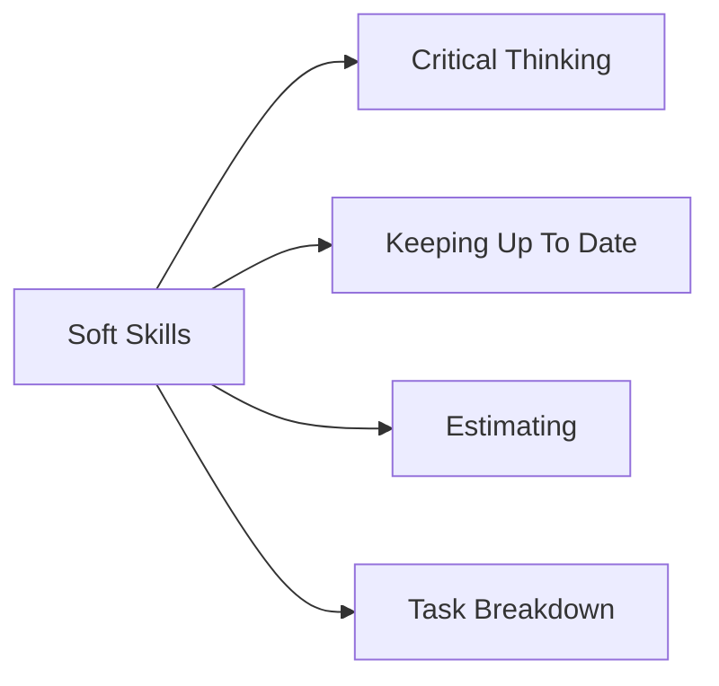

# mermaidRoadmap

```mermaid
flowchart LR
    A["Internet"] --> B["DNS"]
    A --> C["HTTP/HTTPS"]
    A --> D["CDN"]
    click C "https://www.github.com" _blank
```

```mermaid
flowchart LR
    A["Soft Skills"] --> B["Critical Thinking"]
    A --> C["Keeping Up To Date"]
    A --> D["Estimating"]
    A --> E["Task Breakdown"]
```
